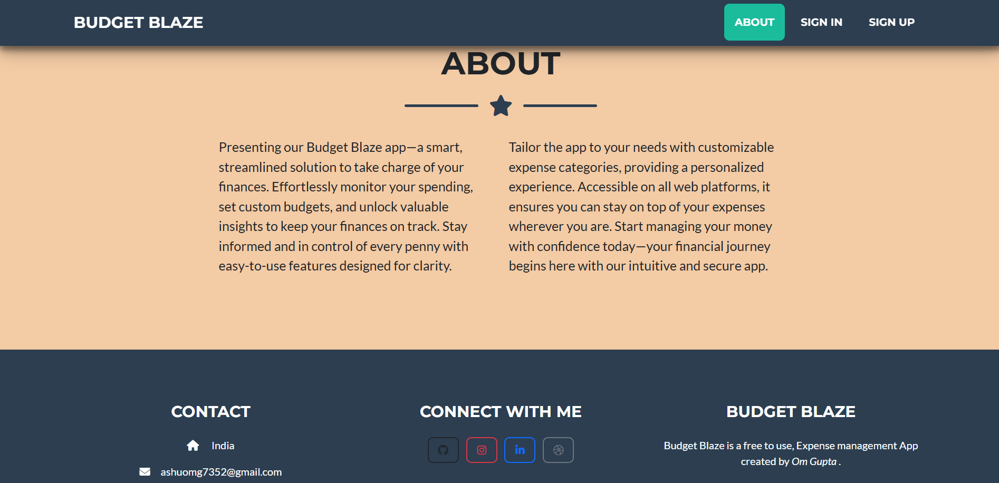
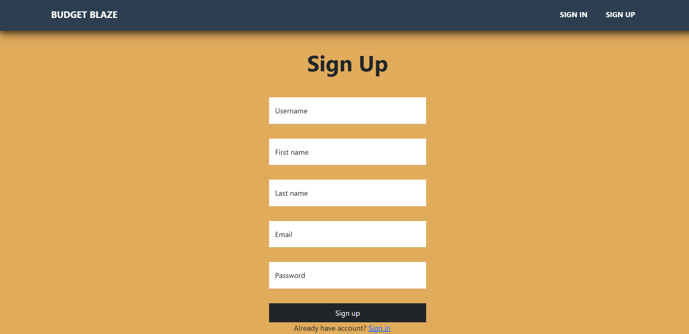
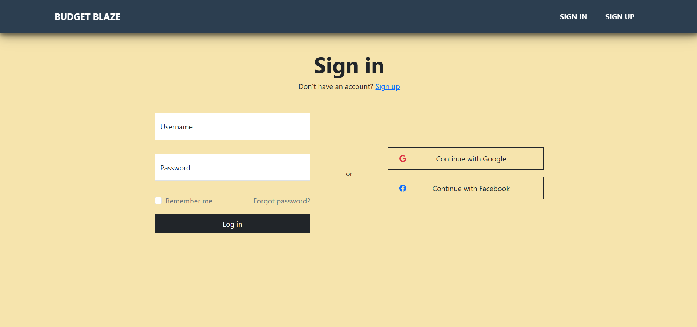
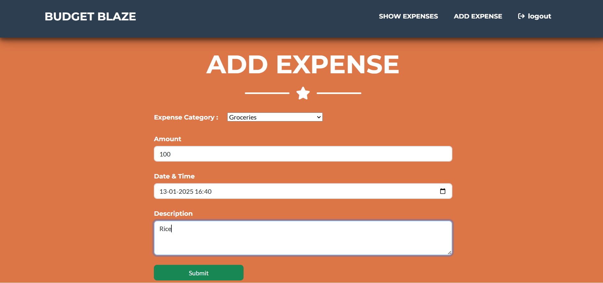
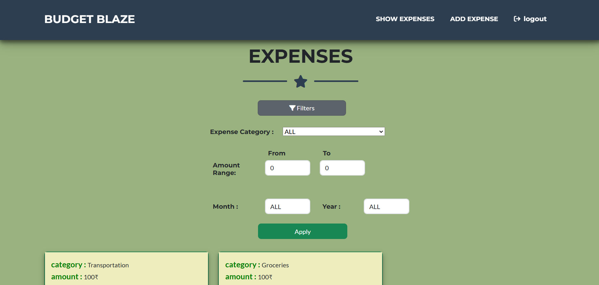
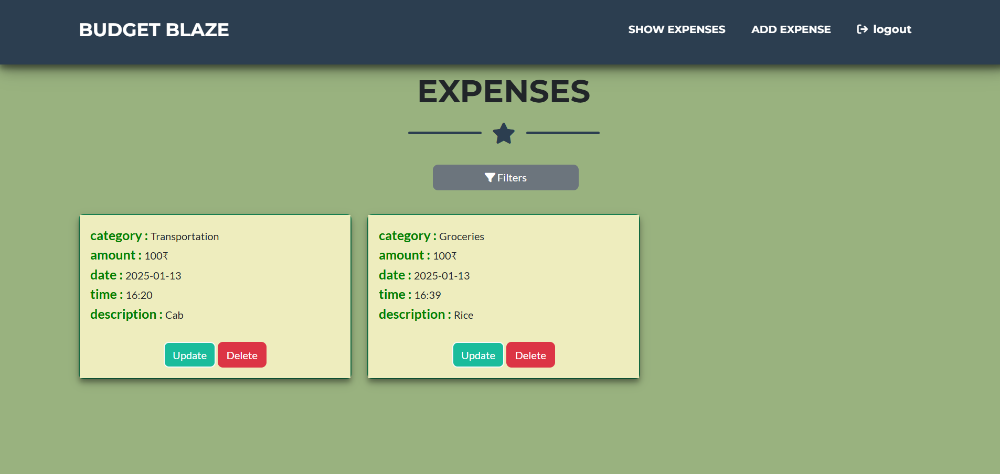
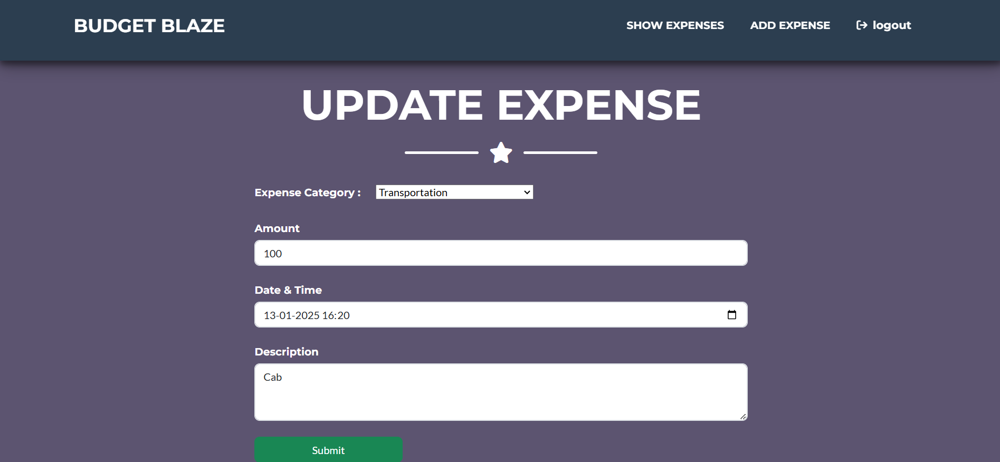

# BudgetBlaze










The **BudgetBlaze** App is a robust financial management tool built with Spring Boot, Spring Security, and PostgreSQL. It offers secure sign-up and sign-in, along with easy expense management through CRUD operations. The user-friendly interface, designed with Thymeleaf and Bootstrap, ensures a smooth experience, while the filtering feature helps users organize and analyze their finances efficiently.

## Table of Contents

- [Features](#features)
- [Demo](#demo)
- [Technologies Used](#technologies-used)
- [Installation](#installation)
- [API Endpoints](#api-endpoints)
- [Contributing](#contributing)

## Features

- **User Authentication and Authorization:** Securely sign up, sign in, and access the app with built-in authentication and authorization.
- **CRUD Operations:** Perform essential financial tracking actions such as adding, reading, updating, and deleting expenses.
- **Filtering:** Utilize the filtering feature to efficiently sort and view expenses based on various criteria.
- **Design:** Responsive & Interactive design with Thymeleaf templates

## Demo

You can try out the BudgetBlaze live [here](https://budgetblaze.onrender.com/).

## Technologies Used

- JAVA17
- Spring Boot
- Spring Web
- Spring Data JPA
- Spring Security
- Spring MVC
- PostgreSQL
- Lombok
- Bootstrap
- HTML
- CSS
- Thymeleaf
- Maven

## Installation

To run this project locally, follow these steps:

1. Clone the repository:

    ```bash
    git clone https://github.com/omgupta7352/BudgetBlaze.git
    ```

2. Navigate to the project directory:

    ```bash
    cd /BudgetBlaze
    ```


3. Build and run the application:

    ```bash
    mvn clean install
    ```

    ```bash
    mvn spring-boot:run
    ```
    

4. Open your web browser and go to `http://localhost:8080`.

## API Endpoints


## 1. Authentication and Authorization
- `POST /api/auth/signup`: Register a new user.
- `POST /api/auth/signin`: Log in a user and generate a JWT token.
- `POST /api/auth/logout`: Log out the user.

## 2. User Management
- `GET /api/users/{id}`: Retrieve user details.
- `PUT /api/users/{id}`: Update user details.
- `DELETE /api/users/{id}`: Delete a user account.

## 3. Expenses Management
- `POST /api/expenses`: Add a new expense.
- `GET /api/expenses`: Retrieve all expenses for the logged-in user.
- `GET /api/expenses/{id}`: Retrieve details of a specific expense.
- `PUT /api/expenses/{id}`: Update an existing expense.
- `DELETE /api/expenses/{id}`: Delete an expense.

## 4. Filtering and Analysis
- `GET /api/expenses/filter`: Filter expenses by date, category, or amount.
- `GET /api/expenses/summary`: Get a summary of expenses (e.g., total spent, by category).


## Contributing

Contributions are welcome! If you would like to contribute to this project, please follow these steps:

1. Fork the repository.
2. Create a new branch for your feature or bugfix:

    ```bash
    git checkout -b feature/your-feature-name
    ```

3. Commit your changes:

    ```bash
    git commit -m 'Add some feature'
    ```

4. Push to the branch:

    ```bash
    git push origin feature/your-feature-name
    ```

5. Open a pull request on GitHub.
  
